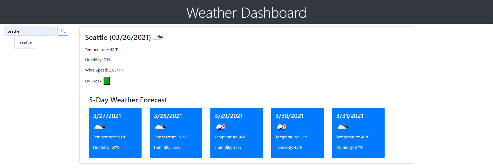

# Weather-Dashboard

## Introduction:

Ever wonder what the weather forecast looks like so you can plan your day accordingly? This weather dashboard not only provides you with what the current weather is, but it also shows the weather forecast for the week! Information such as temperature, humidity, wind speed, and UV index are shown. 

* [Deployed Link](https://dannyphan6.github.io/Weather-Dashboard/)
* [GitHub Repository](https://github.com/dannyphan6/Weather-Dashboard)

## Summary:
1. When user searches for a city, current and 5 day weather forecast are displayed
2. User search is also stored in localStorage and shown as a button to access previous search
3. Data shown are temperature, humidity, wind speed, and UV index
4. User will now know the weather forecast for any city that they input into the search field
5. Plan your day accorindgly based on the weather!
6. Enjoy! 

## Frameworks Used:
1. HTML
2. CSS
3. Bootstrap
4. JavaScript
5. jQuery
